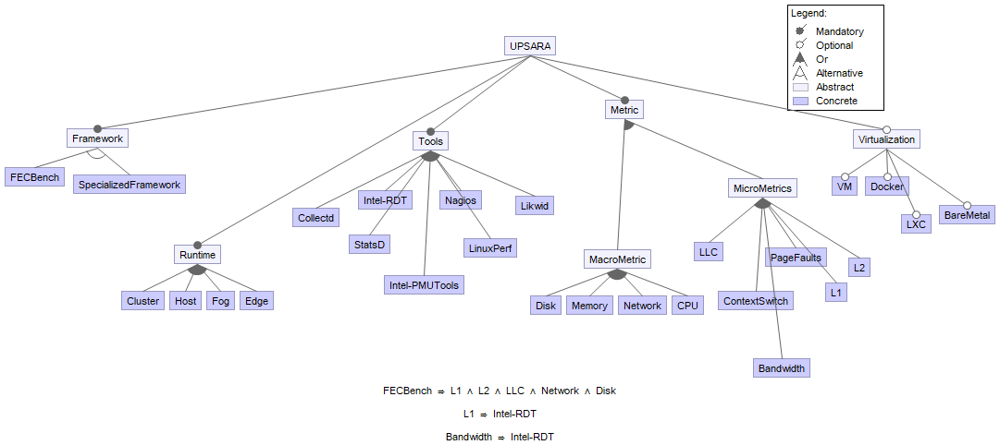

Performance analysis framework for the Cloud-Fog-Edge based applications.
Please explore the tool and open issues if faced with error.

Pull requests are welcomed!

## Installation
First, install the fecbenchstudio following:
- [NodeJS](https://nodejs.org/en/) (v4.x.x recommended)
- [MongoDB](https://www.mongodb.com/)

Second, start mongodb locally by running the `mongod` executable in your mongodb installation (you may need to create a `data` directory or set `--dbpath`).

Then, run `webgme start` from the project root to start . Finally, navigate to `http://localhost:8888` to start using fecbenchstudio!

## Modeling Environment

# Metric Selection

# Application Configuration

# Application Deployment Scenarios

# Configuring the Monitoring Toolbox

# Feature Model

# Embedded Jupyter Notebook 

# CPU Utilization Template File

# Generated Collectd Config

